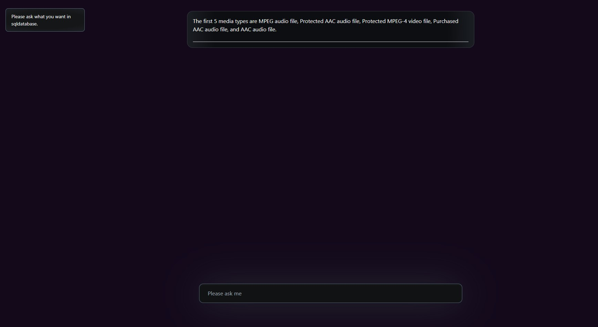

# LangChain Chat App

LangChain Chat App is a real-time chat application that supports multiple languages through the integration of LangChain API. The front-end is built using React, while the back-end is built using Python and SQLite is used as the database.

## Features

- Real-time chat functionality
- User authentication and authorization
- User profiles with avatars
- Responsive UI design

## Installation

To install and run the application:

1. Clone the repository to your local machine.
2. Install dependencies by running `npm install` in the `client` directory and `pip install -r requirements.txt` in the `server` directory.
3. Create a `.env` file in the `server` directory and add the following environment variables:
   - `SECRET_KEY`: secret key for Flask app
   - `DATABASE_URI`: URI for SQLite database
   - `LANGCHAIN_API_KEY`: API key for LangChain API
4. Start the server by running `python backend.py` in the `server` directory.
5. Start the client by running `npm start` in the `client` directory.

## Contributing

If you would like to contribute to this project, please fork the repository and submit a pull request.
